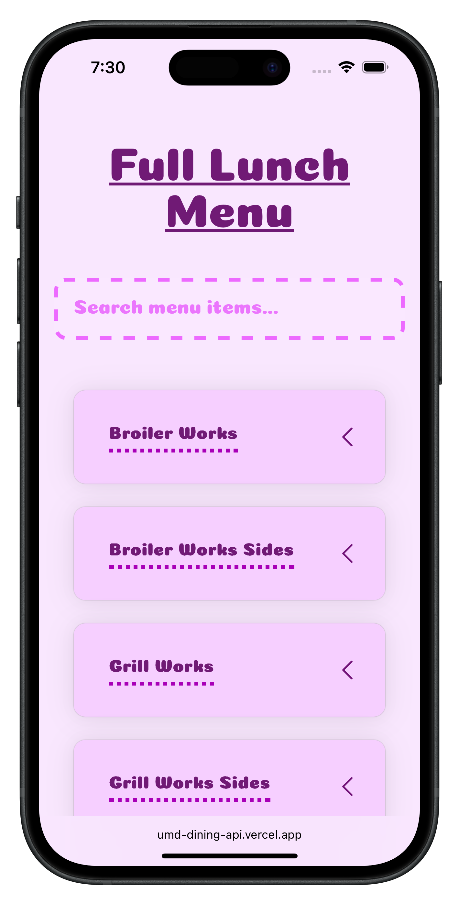
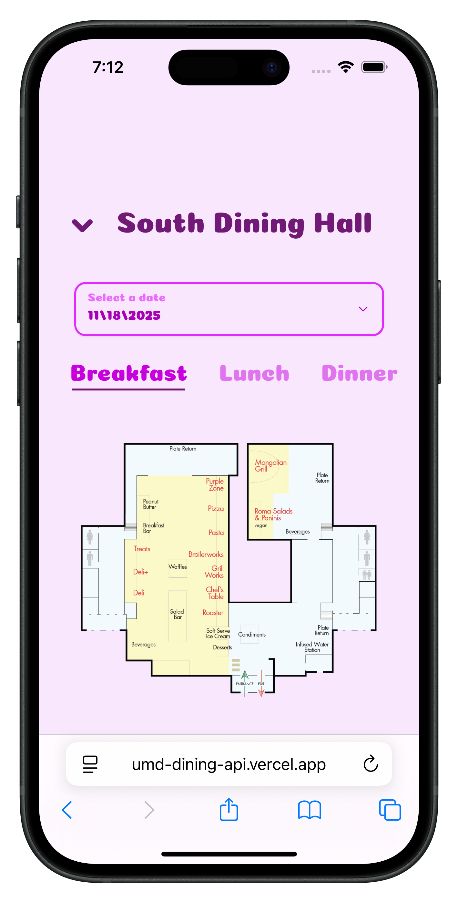
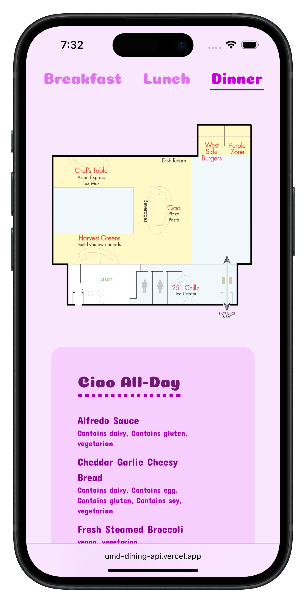
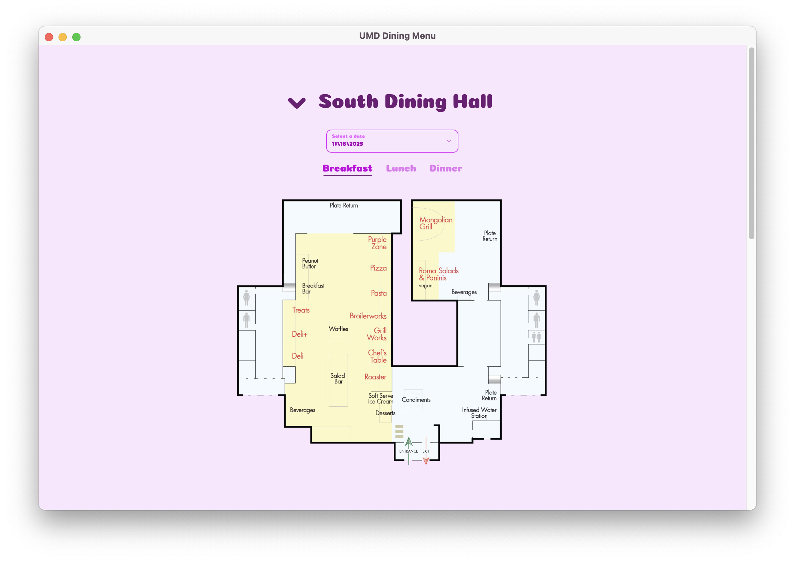
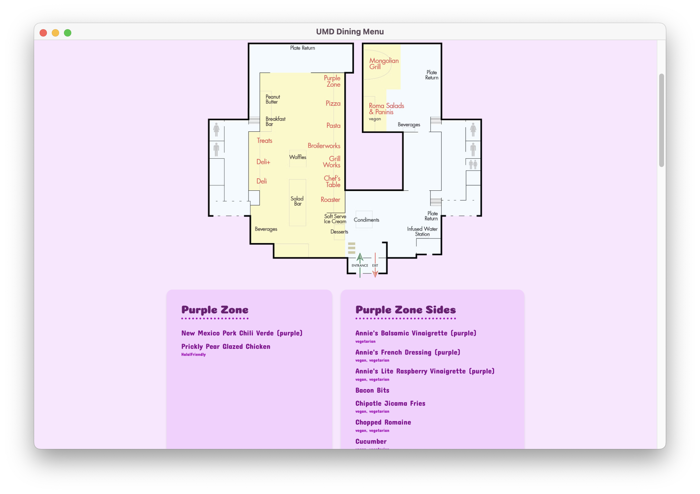
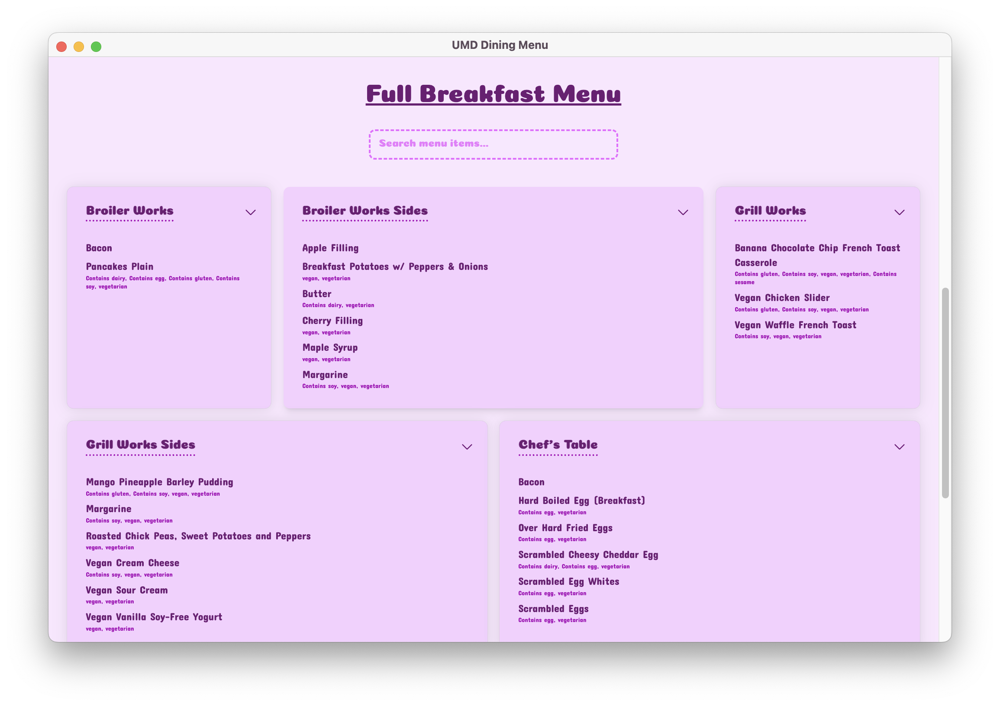

<h1 align="center">
  <a href="https://umd-dining-api.vercel.app" align="center">UMD Dining Website</a>
</h1>

<p align="center">✨A new and improved UI for UMD dining✨</p>
<br>
<br>

<p float="middle">
  
  
  
</p>
<p align="center">
    
</p>
<p float="middle">
    
    
</p>
<br>
<br>
<br>
<br>
<h1 align="center">How to use</h1>
<table border="0" cellpadding="0" cellspacing="0" width="100%">
  <tr>
    <td width="50%" valign="top">
      
    </td>
    <td width="50%" valign="top">
      <h3>Select a Dining Hall and Course</h3>
      <ul>
        <li>Use the header as a dropdown to select between dining halls</li>
        <li>Use the selector below that to to pick which meal of the day you want</li>
    </ul></td>
  </tr>
  <tr>
    <td width="50%" valign="top">
      <h3>Use the Map</h3>
      <p>Use the map to select locations in the floorplan of the dining hall and see what they're offering</p>
    </td>
    <td width="50%" valign="top">
      
    </td>
  </tr>
  <tr>
    <td width="50%" valign="top">
      
    </td>
    <td width="50%" valign="top">
      <h3>Search and View All Food</h3>
      <ul>
        <li>View all the food offered this course with the expandable sections sorted by dining hall sections</li>
        <li>Use the search bar to narrow down the list</li>
    </ul></td>
  </tr>
</table>
<br>
<br>
<br>

# Code Details

## UMD's API Details

- URL: `https://nutrition.umd.edu/?locationNum=${locationNum}&dtdate=${date}`
- Date Format: mm/dd/yyyy
- locationNum: a number representing the dining hall
  - Y = 19
  - South = 16
  - 251 = 51

### Other UMD Details

- Breakfast: Open to 10:30am
- Lunch: 10:30am to 4:00pm
- Dinner: 4:00pm to Close
- <https://nutrition.umd.edu/+the> for the nutrition label thing

## Design

- list of tags as like bubbles at the top, click to select types of food (vegi, all, soy, etc)
- **under the search, have filtering options by allergy stuff**
- collapsible sections: bento box? other categories?
  - dessert, type of cuisine, etc - would need ML model
    - not terrible. max would run 3 times a day but on A LOT of food...
- if I have extra data (cuisine, course, temp, ui pictures (for pixel art thing) etc) - make a db and use id's of each meal for it

## TODO

- make code check the times of meals and auto select the current meal based off the time
- api for meal hours

### Code to get nutrition info

```javascript
function splitAtFirstNumber(str) {
  const match = str.match(/\d/);
  if (!match) return [str];
  const index = match.index;
  return [str.slice(0, index).trim(), str.slice(index).trim()];
}

elms = document.querySelectorAll(".nutfactstopnutrient");
for (let elm of elms) {
  text = elm.textContent;

  if (!text.includes("%") && text.trim() != "") {
    console.log(splitAtFirstNumber(elm.textContent));
  }
}
```

### Code to get hour Details

> Note: this could change based off of years. I just did what UMD is doing rn

```javascript
let diningUrl =
  "https://docs.google.com/spreadsheets/d/1cF6k_mfFCsY1KaS97DLfydGuAAlYx9UK23gEGAL3p0E/gviz/tq?gid=479022338";
const diningVenues = [
  {
    name: "South Campus",
    community: "South Hill Community",
    ids: { B: "south-b", L: "south-l", D: "south-d" },
  },
  {
    name: "Yahentamitsi",
    community: "Heritage Community",
    ids: { B: "yah-b", L: "yah-l", D: "yah-d" },
  },
  {
    name: "251 North",
    community: "Denton Community",
    ids: { B: "n251-b", L: "n251-l", D: "n251-d" },
  },
];

async function fetchDiningHours(url, venues) {
  let data = {};

  await fetch(url)
    .then((r) => r.text())
    .then((txt) => {
      const j = JSON.parse(txt.substr(47).slice(0, -2));
      const rows = j.table.rows.map((r) => r.c.map((c) => (c ? c.v : "")));
      const head = rows[0];

      const today = new Date();
      const todayStr = `${today.getMonth() + 1}/${today.getDate()}`;

      for (let i = 1; i < rows.length; i += 3) {
        const vName = rows[i][0].split("|")[0].trim(); // South Campus etc.
        const venue = venues.find((v) => v.name === vName);
        if (!venue) continue;

        const col = head.findIndex((h) => h && h.startsWith(todayStr));
        if (col === -1) continue; // today not on sheet!

        data[venue.name] = {
          Breakfast: rows[i][col],
          Lunch: rows[i + 1][col],
          Dinner: rows[i + 2][col],
        };
      }
    })
    .catch((err) => console.error("Dining-hall fetch error:", err));
  console.log(data);
}
```
